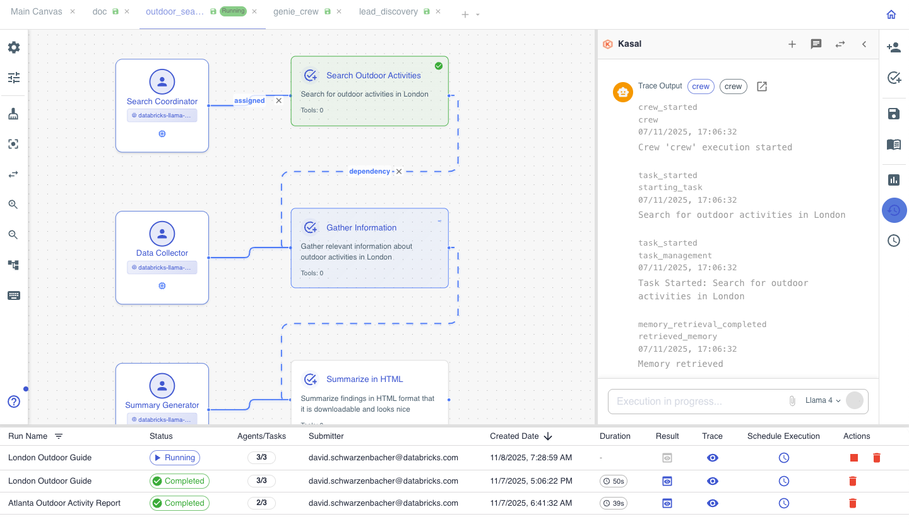

  
  <h1>Kasal</h1>
  
<strong>Build intelligent AI agent workflows with visual simplicity and enterprise power.</strong>

  

    
  

Kasal turns complex AI orchestration into an intuitive visual experience. Design, deploy, and monitor autonomous AI agents that collaborate to solve real-world business problems — without writing orchestration code.

## Why Kasal?

- **Visual Workflow Designer** — Drag-and-drop canvas for composing sophisticated agent interactions
- **Enterprise-Ready** — Built for Databricks with OAuth, workspace isolation, and scale in mind
- **Extensible Toolkit** — A rich library of tools, including Genie, MCP servers, custom APIs, and data connectors
- **Real-Time Monitoring** — Live execution tracking with detailed logs, traces, and performance insights
- **Production-Grade** — Robust error handling, retry logic, and enterprise deployment patterns

## What You Can Build

- **Data Analysis Pipelines** — Agents that query, analyze, and visualize your data
- **Content Generation Systems** — Collaborative agents for research, writing, and content creation
- **Business Process Automation** — Intelligent workflows that adapt and make decisions
- **Customer Support Assistants** — Multi-agent systems with specialized knowledge domains
- **Research & Development** — Agents that gather, synthesize, and present insights

## Get Started in Minutes

### Databricks Marketplace (Recommended)
Install directly from the Databricks Apps Marketplace with one click — the best path for production, with automatic updates and enterprise support.

### Deploy from Source
Use the deployment script in this repository for custom installations. Ideal for tailored configurations and advanced setups.

### Local Development
A quick setup for testing and development — requires Python 3.9+ and Node.js.

## See It in Action

*The visual workflow designer for building AI agent collaborations*

Create your first agent workflow in under two minutes:

1. **Design** — Drag agents onto the canvas and define their roles
2. **Connect** — Link agents together to form collaboration flows
3. **Execute** — Hit run and watch your agents work as a team
4. **Monitor** — Follow real-time logs and execution traces

---

## Documentation

| Topic | Description |
|-------|-------------|
| **[Why Kasal](src/docs/WHY_KASAL.md)** | What problems it solves and who it's for |
| **[Solution Architecture](src/docs/ARCHITECTURE_GUIDE.md)** | Layers, lifecycles, and platform integration |
| **[Code Structure](src/docs/CODE_STRUCTURE_GUIDE.md)** | Where things live and how to navigate the repo |
| **[Developer Guide](src/docs/DEVELOPER_GUIDE.md)** | Local setup, config, and extension patterns |
| **[API Reference](src/docs/api_endpoints.md)** | REST endpoints, payloads, and errors |

### More Documentation
- **[Docs Hub](src/docs/README.md)** - Documentation index
- **[End‑User Tutorial Catalog](src/docs/END_USER_TUTORIAL_CATALOG.md)** - Screenshot-ready walkthroughs
- **[Testing Guide](src/backend/tests/README.md)** - Testing strategy and coverage

---

## Architecture

Kasal follows a clean, layered architecture designed for scalability and maintainability:

**Frontend (React)** → **API (FastAPI)** → **Services** → **Repositories** → **Database**

The CrewAI engine plugs in at the service layer to drive intelligent agent orchestration.

## Known Limitations

### Entity Memory with Specific Models
Entity extraction in memory backends has known compatibility issues with:
- **Databricks Claude** (`databricks-claude-*`) — JSON schema validation errors
- **Databricks GPT-OSS** (`databricks-gpt-oss-*`) — empty response errors

**Automatic fallback:** When these models are detected, Kasal transparently uses `databricks-llama-4-maverick` for entity extraction while keeping your chosen model for every other agent task.

## License

Licensed under the [Databricks License](src/LICENSE)

---

## Additional Resources

[Unlocking Databricks Marketplace: A Hands-On Guide for Data Consumers](https://www.databricks.com/dataaisummit/session/unlocking-databricks-marketplace-hands-guide-data-consumers)