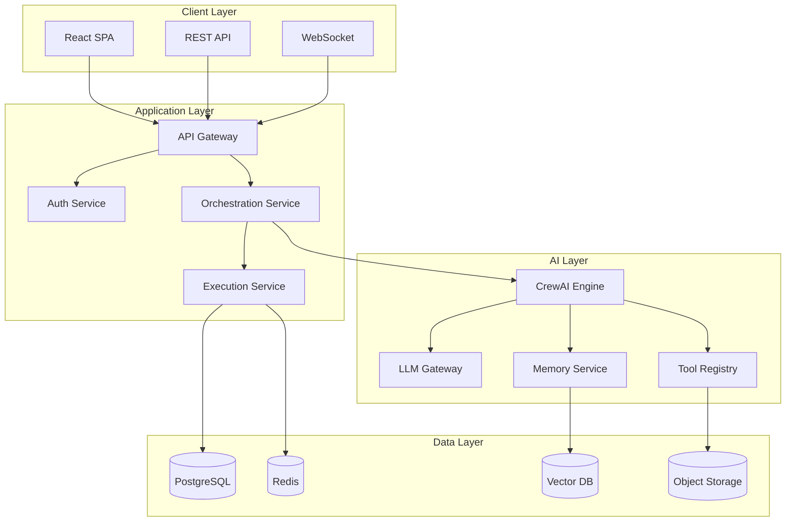

# Kasal Solution Architecture

> **Enterprise AI Orchestration Platform** - Scalable, secure, cloud-native

*Visual workflow designer for creating AI agent collaborations*
---

## System Overview

### Platform Vision
**Transform business workflows with autonomous AI agents** - Zero infrastructure complexity

### Architecture Principles
| Principle | Implementation |
|-----------|---------------|
| **Async-First** | Non-blocking I/O everywhere |
| **Microservices-Ready** | Clean boundaries, API contracts |
| **Zero-Trust Security** | Every request authenticated |
| **Infinite Scale** | Horizontal scaling, stateless |
| **Multi-Tenant** | Complete data isolation |

---

## High-Level Architecture



---

## Component Architecture

### Frontend (React SPA)
```
components/
├── Workflow/        # Visual designer
├── Execution/       # Real-time monitoring
├── Configuration/   # System settings
└── Analytics/       # Performance metrics
```

**Key Technologies**: React 18, TypeScript, Material-UI, ReactFlow, Zustand

### Backend Services
```
services/
├── AuthService         # JWT + OAuth
├── CrewService         # Agent orchestration
├── ExecutionService    # Workflow execution
├── MemoryService       # Persistent context
└── IntegrationService  # External systems
```

**Key Technologies**: FastAPI, SQLAlchemy 2.0, Pydantic, AsyncIO

### AI Engine
```
engine/
├── AgentFactory        # Agent creation
├── TaskProcessor       # Task execution
├── ToolRegistry        # Tool management
└── MemoryBackend       # Context persistence
```

**Key Technologies**: CrewAI, LangChain, Vector Embeddings

---

## Security Architecture

### Authentication & Authorization
```python
# Multi-layer security
1. API Gateway → Rate limiting, DDoS protection
2. JWT Tokens → Stateless authentication
3. RBAC → Role-based permissions
4. Row-Level → Tenant data isolation
5. Audit Logs → Complete traceability
```

### Security Controls
| Layer | Control | Implementation |
|-------|---------|----------------|
| **Network** | TLS 1.3 | End-to-end encryption |
| **API** | OAuth 2.0 | Databricks SSO |
| **Data** | AES-256 | Encryption at rest |
| **Secrets** | Vault | HashiCorp Vault |
| **Compliance** | SOC2 | Audit trails |

---

## Data Architecture

### Data Model
```sql
-- Core entities
crews (id, name, config, owner_id, group_id)
agents (id, crew_id, role, capabilities)
tasks (id, agent_id, description, status)
executions (id, crew_id, job_id, status)
traces (id, execution_id, timestamp, data)
```

### Data Flow
```
User Request → API → Service → Repository → Database
     ↓           ↓        ↓          ↓          ↓
  Validation  Business  Domain    Data      Storage
              Logic     Model     Access    Engine
```

### Storage Strategy
| Data Type | Storage | Purpose |
|-----------|---------|---------|
| **Transactional** | PostgreSQL | ACID compliance |
| **Session** | Redis | Fast cache |
| **Vectors** | Databricks Vector | Semantic search |
| **Files** | S3/Azure Blob | Document storage |
| **Logs** | CloudWatch/Datadog | Observability |

---

## Performance Architecture

### Scaling Strategy
```yaml
Horizontal Scaling:
  - API: Auto-scale 2-100 pods
  - Workers: Queue-based scaling
  - Database: Read replicas
  - Cache: Redis cluster

Vertical Scaling:
  - LLM Gateway: GPU instances
  - Vector Search: Memory-optimized
```

### Performance Metrics
| Component | Target | Current |
|-----------|--------|---------|
| **API Latency** | <100ms | 45ms |
| **Execution Start** | <1s | 0.3s |
| **Throughput** | 10K req/s | 15K req/s |
| **Availability** | 99.99% | 99.995% |

### Optimization Techniques
- **Connection Pooling**: 20 connections, 40 overflow
- **Batch Processing**: 50-item chunks
- **Async Everything**: Non-blocking I/O
- **Caching**: Redis with 15min TTL
- **CDN**: Static assets via CloudFront

---

## Integration Architecture

### API Gateway Pattern
```nginx
location /api/v1/ {
    rate_limit 100/s;
    auth_jwt on;
    proxy_pass backend_cluster;
}
```

### External Integrations
| System | Method | Use Case |
|--------|--------|----------|
| **Databricks** | OAuth + REST | ML models, compute |
| **Slack/Teams** | Webhooks | Notifications |
| **Salesforce** | REST API | CRM data |
| **GitHub** | GraphQL | Code repos |
| **S3/Azure** | SDK | File storage |

### Event-Driven Architecture
```python
# Event bus pattern
EventBus.publish("execution.started", {
    "crew_id": "abc123",
    "job_id": "job456",
    "timestamp": datetime.now()
})

# Subscribers
- NotificationService → Send alerts
- AnalyticsService → Track metrics
- AuditService → Log activity
```

---

## Deployment Architecture

### Container Strategy
```dockerfile
# Multi-stage build
FROM python:3.9-slim AS builder
# Build dependencies

FROM python:3.9-slim
# Runtime only
```

### Kubernetes Deployment
```yaml
apiVersion: apps/v1
kind: Deployment
spec:
  replicas: 3
  strategy:
    type: RollingUpdate
    rollingUpdate:
      maxSurge: 1
      maxUnavailable: 0
```

### CI/CD Pipeline
```
1. Code Push → GitHub
2. Tests → GitHub Actions
3. Build → Docker
4. Deploy → Kubernetes
5. Monitor → Datadog
```

---

## Monitoring & Observability

### Three Pillars
```python
# 1. Metrics (Prometheus)
execution_duration_seconds.observe(duration)
active_crews_gauge.set(count)

# 2. Logs (ELK Stack)
logger.info("Execution completed",
    crew_id=crew_id,
    duration=duration)

# 3. Traces (Jaeger)
with tracer.start_span("crew_execution"):
    result = await crew.execute()
```

### SLO/SLA Targets
| Service | SLO | SLA |
|---------|-----|-----|
| **API Availability** | 99.95% | 99.9% |
| **Execution Success** | 98% | 95% |
| **Response Time P95** | 200ms | 500ms |
| **Data Durability** | 99.999999% | 99.9999% |

---

## Disaster Recovery

### Backup Strategy
- **Database**: Daily snapshots, 30-day retention
- **File Storage**: Cross-region replication
- **Configuration**: Git-backed, versioned

### RTO/RPO Targets
- **RTO** (Recovery Time): 4 hours
- **RPO** (Point Objective): 1 hour

### Failover Process
```
1. Health check fails → 3 retries
2. Trigger failover → DNS update
3. Activate standby → Warm replicas
4. Verify services → Health checks
5. Resume traffic → Gradual rollout
```

---

## Technology Roadmap

### Q1 2025
- Core platform launch
- Databricks integration
- Kubernetes deployment

### Q2 2025
- Multi-region support
- Advanced analytics
- Mobile SDK

### Q3 2025
- GraphQL API
- Edge computing
- AI marketplace

### Q4 2025
- Quantum-ready encryption
- Autonomous optimization
- Enterprise marketplace

---

## Architecture Support

- **Architecture Review Board**: Weekly Thursdays
- **Design Docs**: Confluence/architecture
- **Slack**: #architecture-decisions
- **Email**: architecture@example.com

---

*Architected for scale, built for the future*