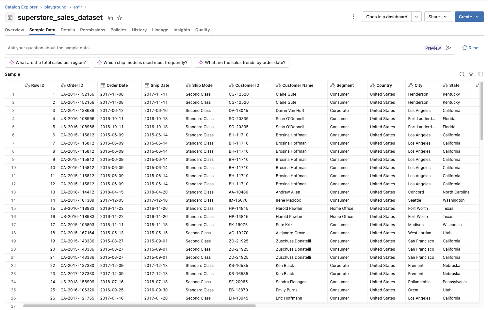
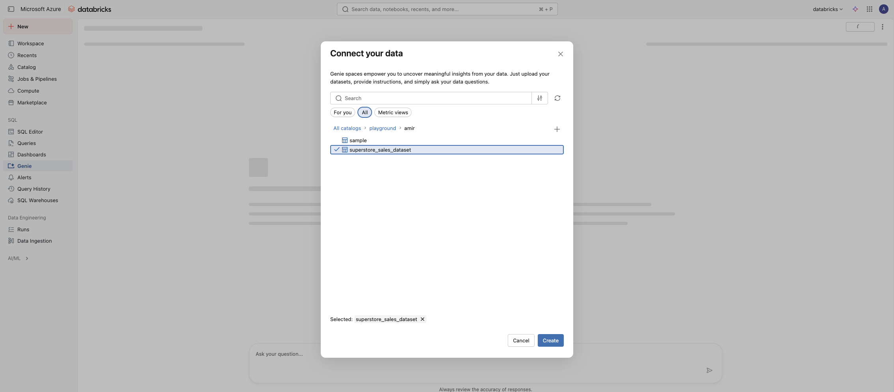
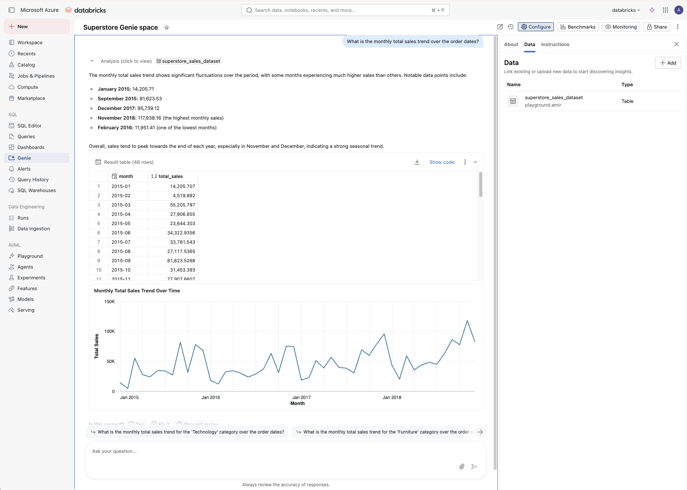

# Creating a Genie Space for the Superstore dataset

Prepare the Superstore dataset and connect it to Databricks Genie so it can be used inside Kasal agent workflows.

This guide explains how to prepare the **Superstore dataset** and connect it to **Databricks Genie** so it can be used inside Kasal agent workflows.

## Before you begin

- A Databricks workspace with Unity Catalog enabled
- Permission to create tables and Genie Spaces
- A Kaggle account to download the dataset

The setup consists of three steps:

1. Download the dataset from Kaggle
2. Load the dataset into Unity Catalog
3. Create a Genie Space connected to the dataset

---

## Step 1 — Download the Superstore dataset

Download the [Superstore dataset on Kaggle](https://www.kaggle.com/datasets/vivek468/superstore-dataset-final/data).

After downloading, extract the dataset locally.

This file contains sales transactions including:

- region
- category
- sales
- ship mode
- product name
- order date

---

## Step 2 — Upload the dataset to Databricks

Open your **Databricks Workspace**.

Navigate to:

Catalog → add data → create or modify table

Upload the Superstore CSV file.

---

## Step 3 — Create a Unity Catalog table

During the upload process configure:

Example:

Catalog: main
Schema: sales
Table name: superstore_orders

Databricks will automatically infer the schema.

Example columns:

| Column | Description |
|------|------|
| order date | Order timestamp |
| region | Sales region |
| category | Product category |
| sub_category | Product sub-category |
| sales | Revenue |
| product name | Product name |

## Creating a Genie Space in Databricks

Before running the Kasal workflow, a Genie Space must be created and connected to the dataset.

---

## Step 4 — Create a new Genie Space and connect the dataset

Click **New**.

Connect the Genie Space to your Unity Catalog tables.

---

## Step 5 — Test the Genie Space

Test the Genie Space with a natural language query.

Example:

What is the monthly total sales trend over the order dates?

---

## Result

Genie returns a structured table with aggregated metrics that can be used by downstream agent workflows.

The Genie Space is now ready to be used by Kasal.

## Next steps

- [Running the Kasal agent workflow](./kasal-agent-workflow.md) — build and run the Genie-backed workflow
- [Genie superstore insights blueprint](./README.md) — the full blueprint overview

Back to the [documentation hub](../../README.md).