# Running the Kasal agent workflow

Build and run a Genie-backed Kasal workflow that retrieves Superstore data, analyzes it, and produces a business-ready summary.

## Before you begin

- A Genie Space connected to the Superstore dataset (see [Creating a Genie Space for the Superstore dataset](./create_genie_space.md))
- Access to the Kasal Workflow Designer
- The GenieTool enabled for your teamspace

This guide explains how to run the **Genie-backed Kasal workflow** for the Superstore dataset.

The workflow demonstrates how Kasal agents can retrieve enterprise data from **Databricks Genie**, analyze the results, and produce a business-ready summary.

The pattern implemented in this workflow is:

Retrieve → Analyze → Write

---

## Workflow overview

The workflow uses four agents:

| Agent | Role | Responsibility |
|------|------|---------------|
| Query Planner | Analytics Question Planner | Converts business questions into precise Genie prompts |
| Genie Retriever | Databricks Genie Query Executor | Retrieves structured data from Genie |
| Data Analyst | KPI & Trend Analyst | Analyzes results and extracts insights |
| Business Writer | Executive Summary Writer | Produces a stakeholder-ready narrative |

---

## Chapter 1 — Open the workflow designer

**Scene:** Sarah wants to answer a business question using sales data from the Superstore dataset.

To begin, she opens the **Kasal Workflow Designer**.

### Expected result

You should see a **blank workflow canvas** with:

- Agents panel
- Tasks panel
- Catalog
- Chat panel

### Screenshot

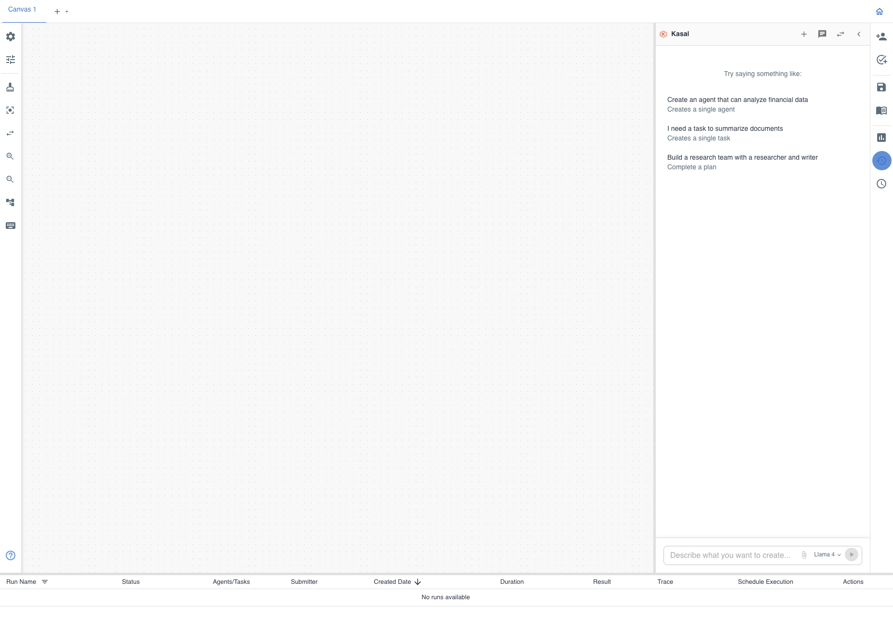

---

## Chapter 2 — Create the agents

Sarah creates a small team of specialized agents.

Each agent has a clearly defined responsibility.

---

### Agent 1 — Query Planner

Click:

Agents → + Add Agent

Fill the fields:

Name: Query Planner  
Role: Analytics Question Planner  
Goal: Convert business questions into precise Genie queries

Backstory:

You break down business questions into measurable metrics, dimensions, and time filters and produce a single clean query prompt for Genie.

Save the agent.

Expected Result: A Query Planner node appears on the workflow canvas.

Screenshot:

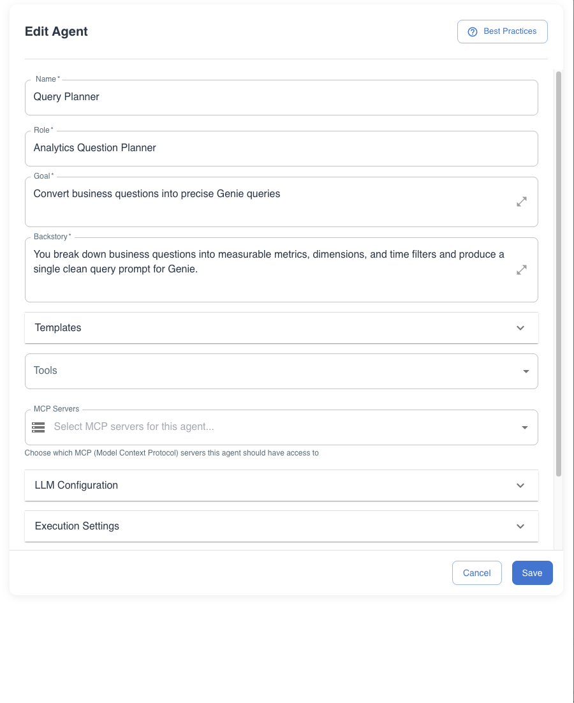

---

### Agent 2 — Genie Retriever

Click:

Agents → + Add Agent

Fill the fields:

Name: Genie Retriever  
Role: Databricks Genie Query Executor  
Goal: Retrieve structured results from a Genie space connected to Superstore tables

Backstory:

You are skilled at asking Genie for tabular outputs with clear columns and time windows. You return results in a clean, structured form.

Add the GenieTool to the Tools field. Then select the Superstore Genie Space that is already created.

Save the agent.

Expected Result: The Genie Retriever agent appears on the canvas.

Screenshot:

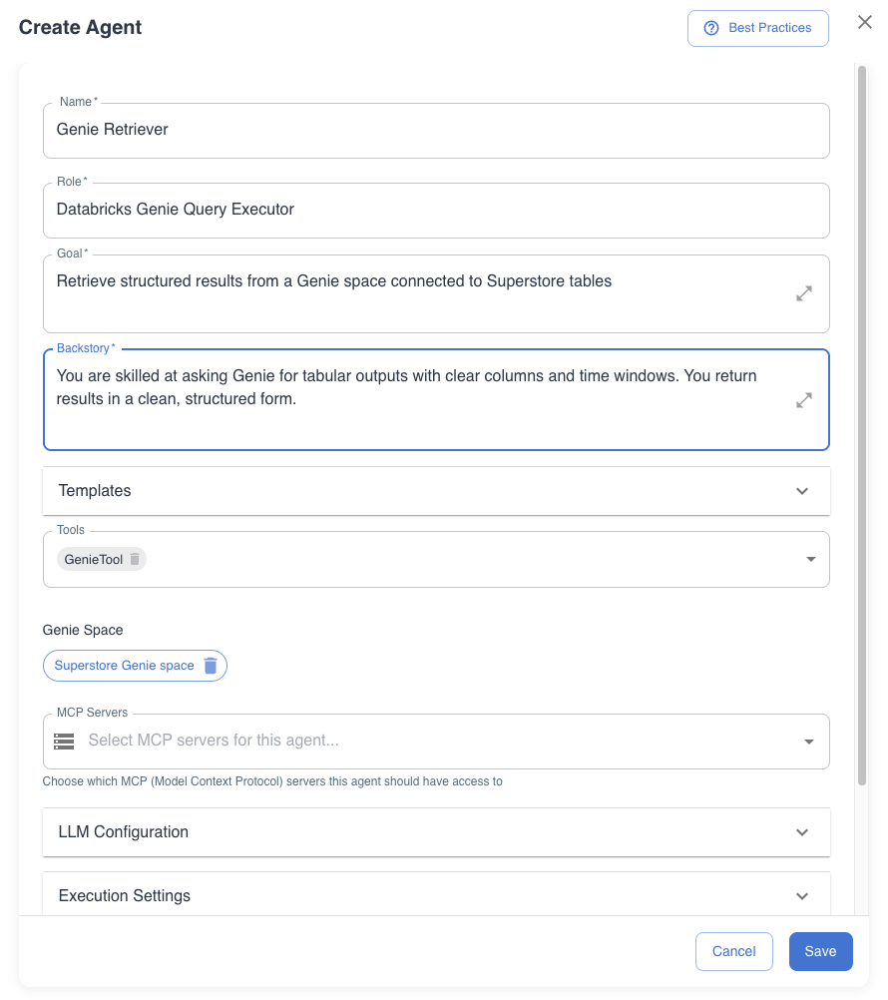

Note: Ensure the Genie tool integration is enabled for this agent.

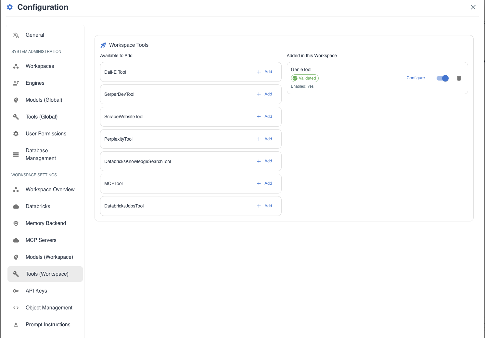

---

### Agent 3 — Data Analyst

Click:

Agents → + Add Agent

Fill the fields:

Name: Data Analyst  
Role: KPI & Trend Analyst  
Goal: Post-process retrieved results into insights, trends, anomalies, and comparisons

Backstory:

You analyze tables, compute deltas, identify drivers, and produce a structured insight list with quantified takeaways.

Save the agent.

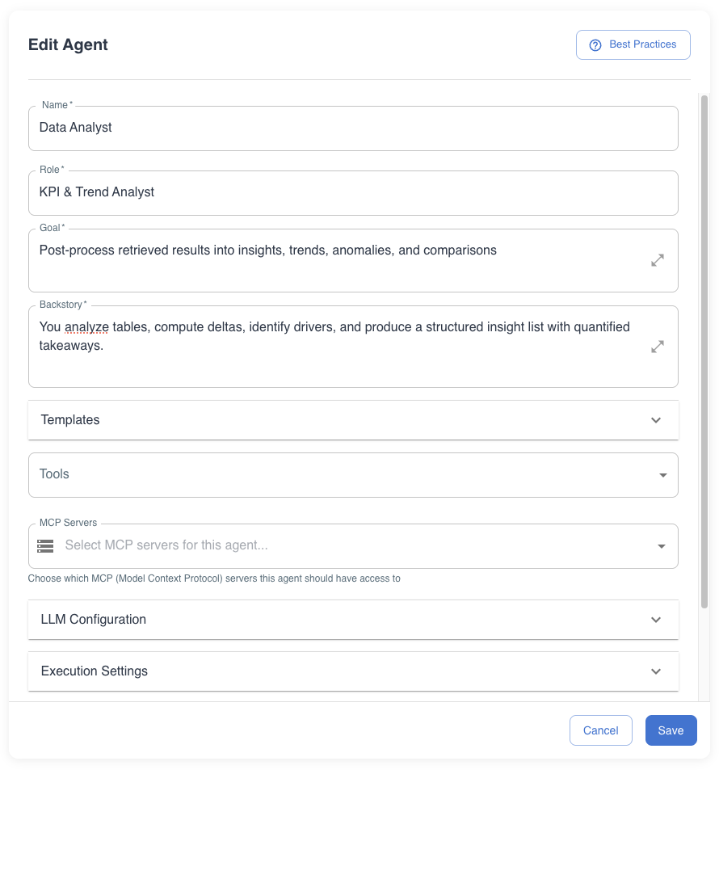

---

### Agent 4 — Business Writer

Click:

Agents → + Add Agent

Fill the fields:

Name: Business Writer  
Role: Executive Summary Writer  
Goal: Turn insights into a stakeholder-ready summary with recommendations

Backstory:

You write clear, concise narratives for sales leadership: what happened, why it matters, and what to do next.

Save the agent.

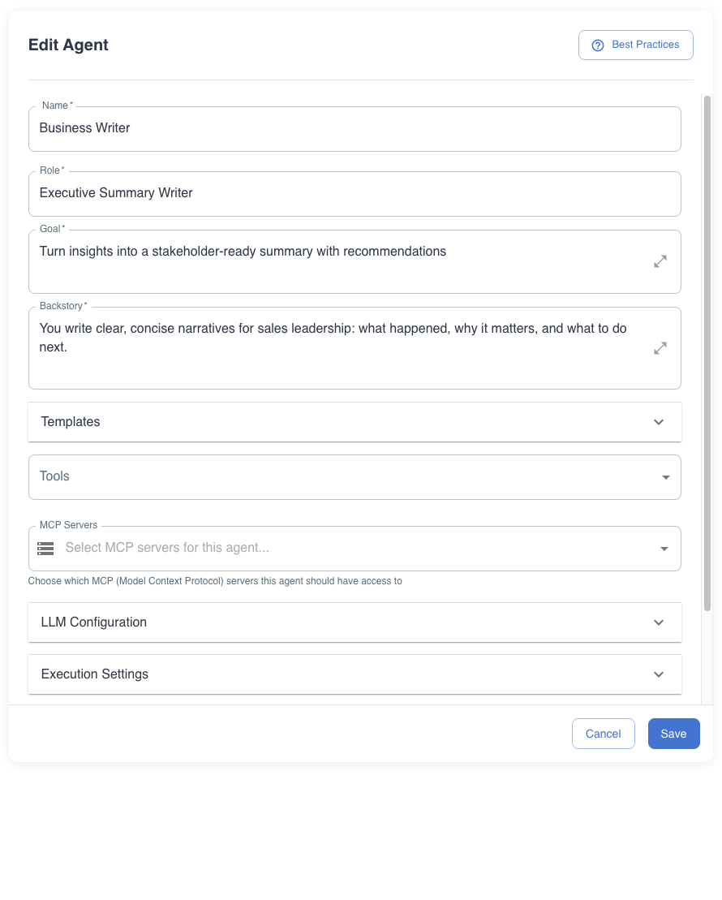

---

## Chapter 3 — Add tasks and build the workflow

Sarah now creates the pipeline that connects the agents.

The workflow consists of four tasks.

---

### Task 1 — Plan Genie query

Click:

Tasks → + Add Task

Title: Plan Genie Query

Description:

Create one precise Genie prompt to answer the business question {question} using data from Genie space. The prompt must request a tabular result and specify the timeframe if relevant.

Expected Output:

A single Genie prompt (verbatim), plus a short note listing the metrics/dimensions it

Connect this task to the Query Planner agent.

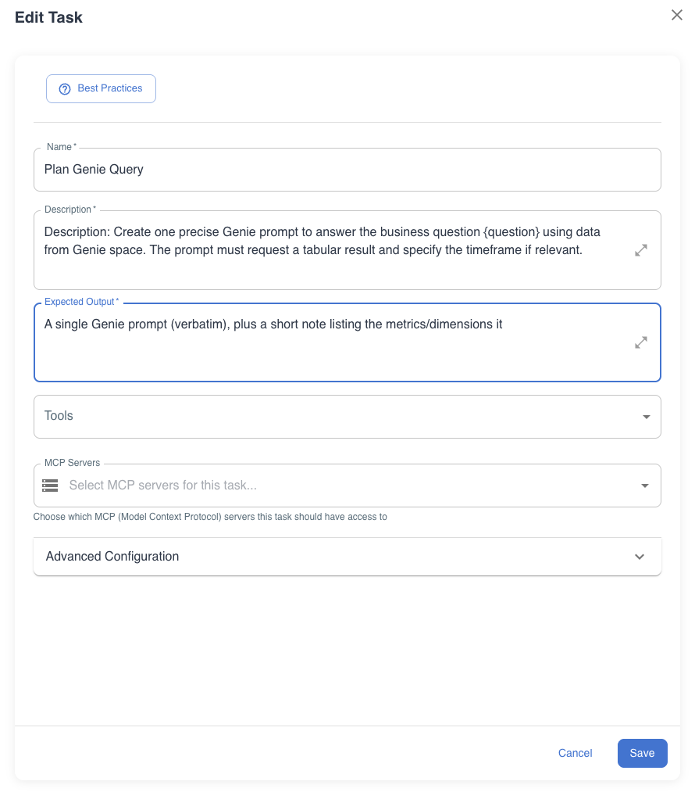

---

### Task 2 — Retrieve data from Genie

Create another task.

Title: Retrieve Data from Genie

Description:

Use the Genie prompt from the previous task to query Genie space. Return the results in a structured format. Include the exact Genie prompt used and the returned table (or key rows). If results are ambiguous, run one clarification prompt.

Expected Output:

1. Genie prompt used
2. Tabular results (or a clean structured representation)
3. Any caveats (filters/time window assumptions, missing values)

Save

Connect this task to Genie Retriever.

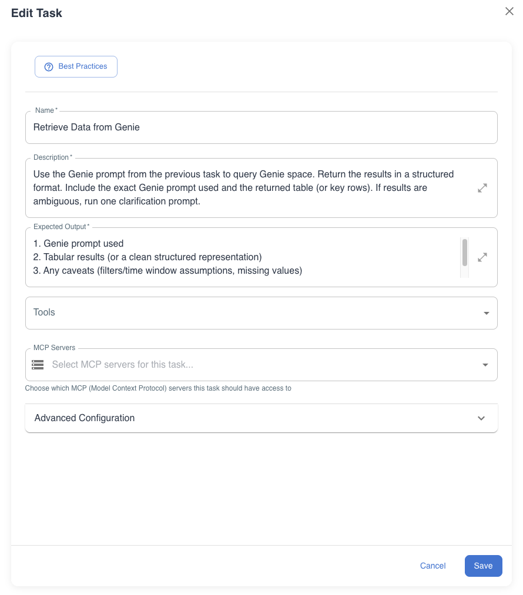

---

### Task 3 — Post-process and extract insights

Title: Post-process & Extract Insights

Description:

Analyze the retrieved Genie results and produce insights. Compute derived KPIs if possible (e.g., profit margin = profit/sales). Identify top drivers, underperformers, and any anomalies. Output a structured list of 5–10 insights with numbers.

Expected Output:

A numbered list of insights with quantified evidence, plus 2–3 hypotheses/drivers.

Connect this task to Data Analyst.

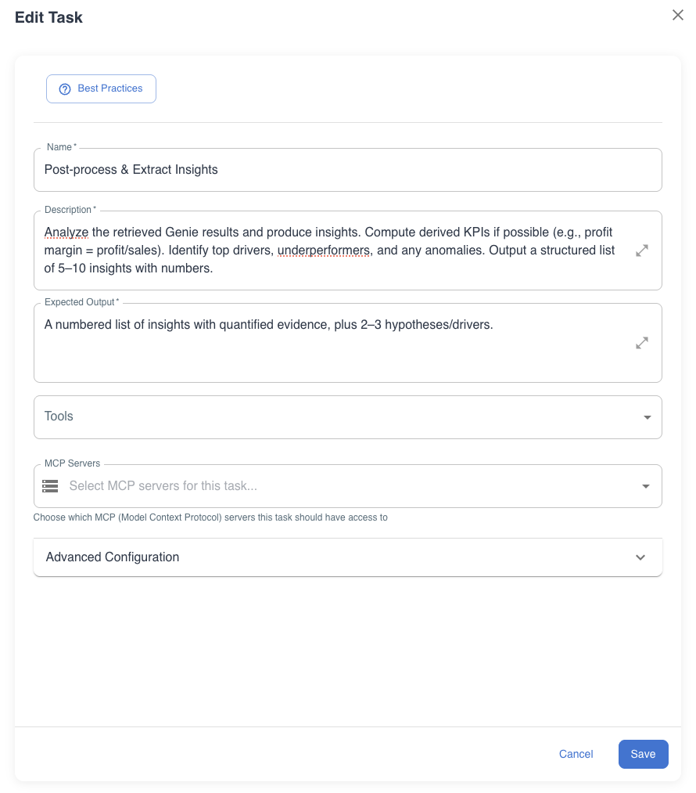

---

### Task 4 — Write executive summary

Title: Write Executive Summary

Description:

Using the extracted insights, write a concise executive summary answering {question}. Include key findings, implications, and recommended next actions. Max 250–350 words.

Expected Output:

A stakeholder-ready summary with bullet takeaways and next steps.

Connect this task to Business Writer.

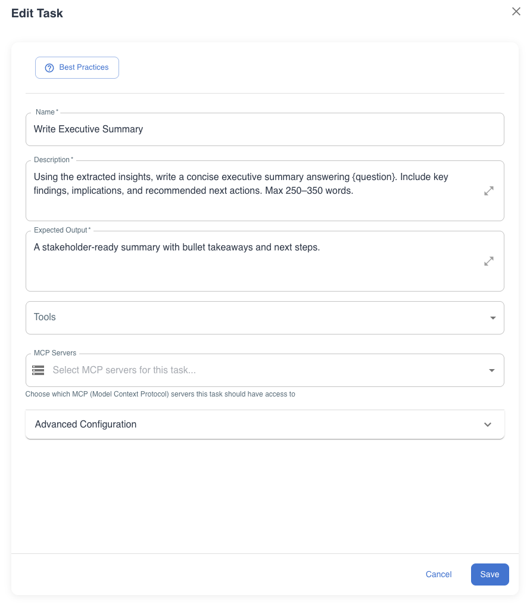

---

## Connect the workflow

Link the tasks in order:

Plan Genie Query → Retrieve Data from Genie → Post-process & Extract Insights → Write Executive Summary

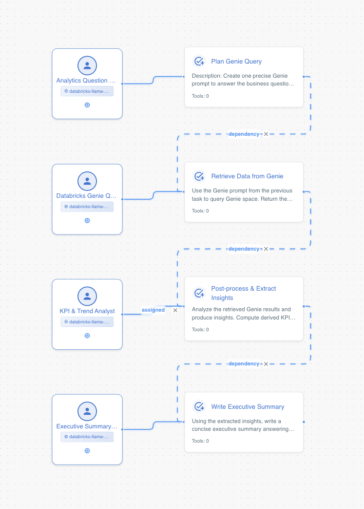

---

## Chapter 4 — Run the workflow

Select your desired LLM model and click on the execution button

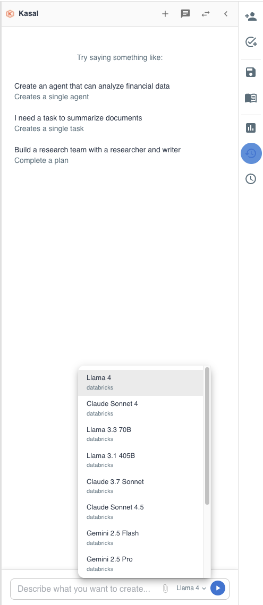

Provide runtime variables.

Example:

question = "Which regions had the lowest total sales last quarter, and what categories drove it?"

Expected Result:

The workflow produces:

- structured insights from Genie data
- analysis of key sales trends
- a concise executive summary

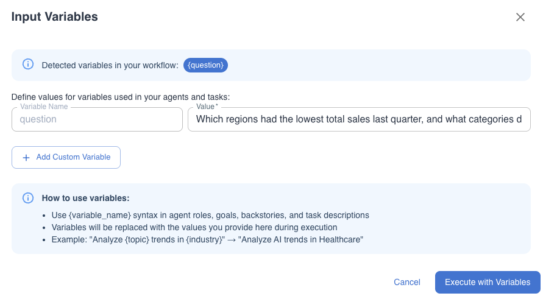

---

## Enterprise extensions

This workflow pattern can be extended to support enterprise analytics use cases such as:

- automated Power BI dashboard updates
- financial performance monitoring
- anomaly detection workflows
- multi-space Genie queries across different business domains

---

## Chapter 5 — Inspect the workflow trace and export results

After the workflow finishes running, Kasal provides detailed trace information that allows you to inspect how each agent executed its task and what outputs were produced at each stage.

This is particularly useful for:

- debugging workflows
- understanding intermediate reasoning steps
- validating outputs before sharing them with stakeholders

---

### Step 1 — Open the execution trace

After the workflow finishes running, click the **Trace** button in the execution panel.

The trace view shows the internal execution flow of the workflow.

---

### Step 2 — Inspect each workflow step

In the trace interface you can inspect each task executed by the agents.

Typical steps visible in this workflow:

1. **Plan Genie Query**  
   Shows the generated prompt that will be sent to the Genie space.

2. **Retrieve Data from Genie**  
   Displays the query executed by Genie and the returned dataset.

3. **Post-process & Extract Insights**  
   Shows the derived metrics and extracted insights generated by the Data Analyst agent.

4. **Write Executive Summary**  
   Displays the final narrative produced by the Business Writer agent.

This trace view allows you to verify that:

- the Genie query was correct
- the retrieved data is accurate
- the insights align with the retrieved results

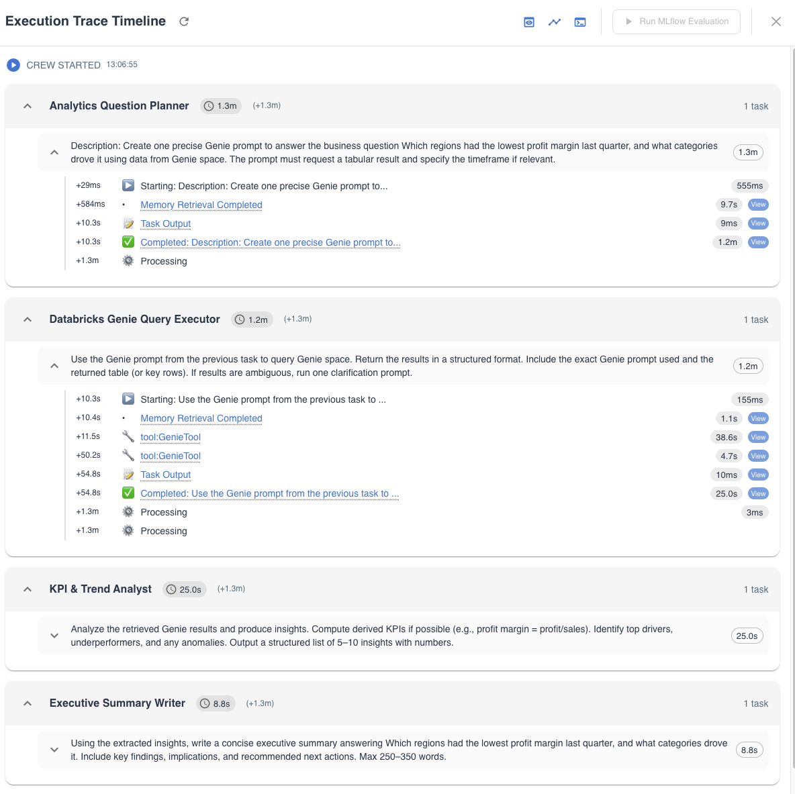

---

### Step 3 — View the final result

Once the workflow finishes executing, the final result appears in the **Output panel**.

The output typically contains:

- key insights extracted from the data
- supporting metrics retrieved from Genie
- a concise executive summary

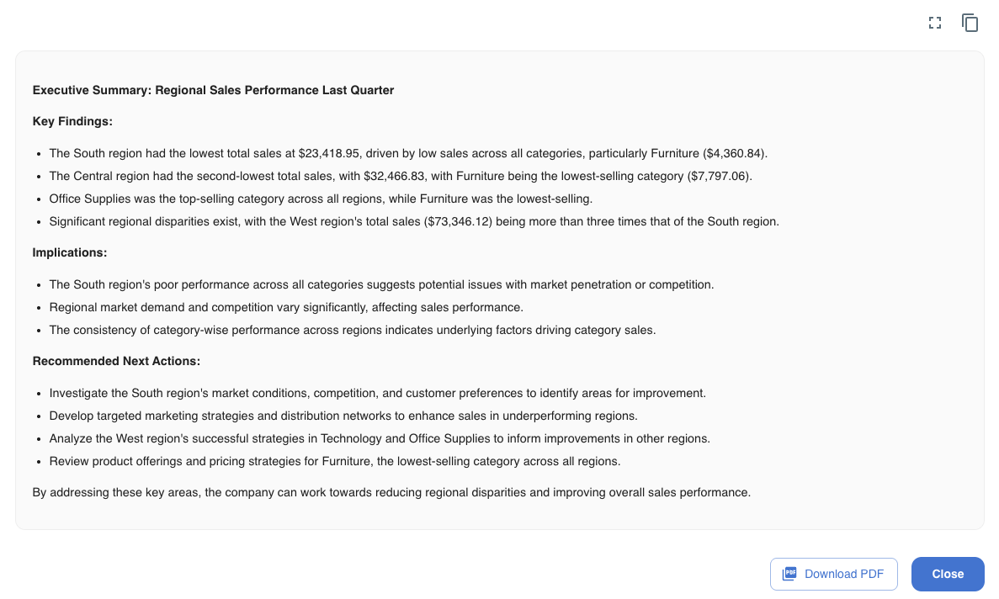

---

### Step 4 — Export the results as PDF

Kasal allows you to export the workflow output.

Click **Export → Save as PDF** to generate a shareable report.

This feature allows teams to easily distribute results to:

- business stakeholders
- sales teams
- executives

---

### Result

You now have a complete workflow that:

1. retrieves enterprise data from **Databricks Genie**
2. analyzes the results using **multiple agents**
3. generates an **executive-ready summary**
4. allows inspection through **trace views**
5. produces a **shareable PDF report**

This pattern demonstrates how Kasal workflows can transform enterprise data into actionable business insights.

## Next steps

- [Genie superstore insights blueprint](./README.md) — the full blueprint overview
- [Creating a Genie Space for the Superstore dataset](./create_genie_space.md) — set up the Genie backend
- [Crew export and deployment](../../crew-export-deployment.md) — ship this workflow as a Databricks App

Back to the [documentation hub](../../README.md).