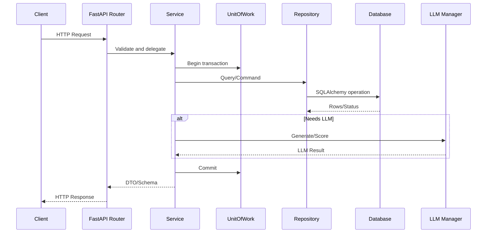
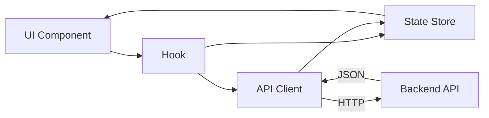

## Developer Guide
Build, extend, and debug Kasal efficiently. This guide focuses on day-to-day workflows.

### Components you'll touch
- **Frontend (React SPA)**: UI, designer, monitoring
- **API (FastAPI)**: REST endpoints and validation
- **Services**: Orchestration and business logic
- **Repositories**: DB and external I/O (Databricks, Vector, MLflow)
- **Engines (CrewAI)**: Agent/flow preparation and execution
- **Data & Storage**: SQLAlchemy models/sessions, embeddings, volumes

### Requirements
Tools and versions you need before running the stack.
- Python 3.9+
- Node.js 18+
- Postgres (recommended) or SQLite for local dev
- Databricks access if exercising Databricks features
## Developer Architecture Overview  
This section gives developers a high-level view of the front end and back end. It explains core components and shows how to understand and trace them.

## Backend Architecture  
The backend uses FastAPI with a clean layered structure. It separates HTTP routing, business services, repositories, and SQLAlchemy models.

### Core Components  
- API Routers: src/backend/src/api/* map HTTP endpoints to service calls.  
- Services: src/backend/src/services/* implement business logic and transactions.  
- Repositories: src/backend/src/repositories/* handle database CRUD.  
- Models/Schemas: src/backend/src/models/* and src/backend/src/schemas/* define persistence and I/O contracts.  
- Core/Engines: src/backend/src/core/* and src/backend/src/engines/* integrate LLMs and execution flows.  
- DB/Session: src/backend/src/db/* configures sessions and Alembic migrations.  
- Config/Security: src/backend/src/config/* and src/backend/src/dependencies/* provide settings and auth.

### Typical Request Flow  
A request passes through router, service, repository, and database. LLM calls route through the LLM manager when needed.



### How to Understand Backend Components  
- Start at the router file for the endpoint path.  
- Open the service it calls and read business logic.  
- Inspect repository methods and referenced models.  
- Check schema types for request and response contracts.  
- Review unit tests under `src/backend/tests` for examples.

### Example: Minimal Endpoint Wiring  
This shows a typical router, service, and repository connection.

```python
# router.py
@router.get("/items/{item_id}", response_model=ItemOut)
async def get_item(item_id: UUID, service: ItemService = Depends(...)):
    return await service.get_item(item_id)

# services/item_service.py
class ItemService:
    async def get_item(self, item_id: UUID) -> ItemOut:
        with self.uow as uow:
            item = uow.items.get(item_id)
            return ItemOut.model_validate(item)

# repositories/item_repository.py
class ItemRepository(BaseRepository[Item]):
    ...
```

## Frontend Architecture  
The frontend is a React + TypeScript application. It organizes UI components, API clients, state stores, hooks, and utilities.

### Core Components  
- API Clients: src/frontend/src/api/* wrap HTTP calls with typed methods.  
- UI Components: src/frontend/src/components/* render views and dialogs.  
- Hooks: src/frontend/src/hooks/* encapsulate logic and side effects.  
- Stores: src/frontend/src/store/* manage app and workflow state.  
- Types/Config: src/frontend/src/types/* and src/frontend/src/config/* provide typing and environment.  
- Utils: src/frontend/src/utils/* offer reusable helpers.

### UI Data Flow  
Components call hooks, which use stores and API clients. Responses update state and re-render the UI.



### How to Understand Frontend Components  
- Locate the component rendering the feature.  
- Check its hook usage and props.  
- Open the API client method it calls.  
- Review the store slice it reads or writes.  
- Inspect related types in src/frontend/src/types.

### Example: Calling an API From a Component  
A component loads items using an API service and updates local state.

```ts
// api/ItemService.ts
export async function getItem(id: string) {
  const res = await fetch(`/v1/items/${id}`, { headers: { Authorization: `Bearer ${token}` } });
  if (!res.ok) throw new Error("Failed");
  return (await res.json()) as Item;
}

// components/Items/ItemView.tsx
const ItemView: React.FC<{ id: string }> = ({ id }) => {
  const [item, setItem] = useState<Item | null>(null);
  useEffect(() => { getItem(id).then(setItem); }, [id]);
  return item ? <div>{item.name}</div> : <span>Loading...</span>;
};
```

## End-to-End flow
This ties front end and back end with shared contracts. It helps new developers trace a feature quickly.

- Frontend Component → Hook → Store/API Client → Backend Router → Service → Repository → DB.  
- Shared types and response shapes live in frontend types and backend schemas.  
- Tests in src/backend/tests and frontend __tests__ show usage patterns.