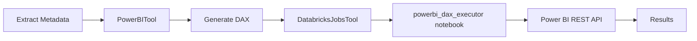

# Power BI Notebook Deployment Guide

## Quick Start

The Power BI DAX executor notebook is automatically included when you deploy the Kasal application.

### Automatic Deployment (Included in App Deployment)

When you deploy Kasal, the notebook is automatically deployed:

```bash
python src/deploy.py --app-name kasal --user-name your.email@company.com
```

**Deployed Notebooks**:
- `/Users/your.email@company.com/kasal_notebooks/powerbi_dax_executor`
- `/Users/your.email@company.com/kasal_notebooks/powerbi_metadata_extractor`

### Manual Notebook Deployment (Optional)

If you only need to deploy/update the notebooks:

```bash
cd src/backend
python -m src.utils.notebook_deployment your.email@company.com
```

## Using the Deployed Notebook

### Option 1: Create Databricks Job (Recommended)

Use the DatabricksJobsTool or Databricks UI to create a job:

```json
{
  "name": "Power BI DAX Executor",
  "tasks": [
    {
      "task_key": "execute_dax",
      "notebook_task": {
        "notebook_path": "/Users/your.email@company.com/kasal_notebooks/powerbi_dax_executor",
        "base_parameters": {}
      },
      "job_cluster_key": "default_cluster"
    }
  ],
  "job_clusters": [
    {
      "job_cluster_key": "default_cluster",
      "new_cluster": {
        "spark_version": "13.3.x-scala2.12",
        "node_type_id": "i3.xlarge",
        "num_workers": 2
      }
    }
  ]
}
```

### Option 2: Run with Parameters

Execute the job with these parameters (as a single `job_params` JSON string):

```json
{
  "job_params": "{\"dax_statement\": \"EVALUATE SUMMARIZECOLUMNS('TestData'[product], \\\"Total NSR\\\", SUM('TestData'[nsr]))\", \"workspace_id\": \"12345678-1234-1234-1234-123456789012\", \"semantic_model_id\": \"87654321-4321-4321-4321-210987654321\", \"auth_method\": \"service_principal\", \"client_id\": \"your-client-id\", \"tenant_id\": \"your-tenant-id\", \"client_secret\": \"your-secret\"}"
}
```

## Power BI Metadata Extractor

The metadata extractor notebook helps you semi-automatically create metadata for PowerBITool.

### Deploying Metadata Extractor

The metadata extractor is automatically deployed alongside the DAX executor:

```bash
python src/deploy.py --app-name kasal --user-name your.email@company.com
```

**Deployed to**: `/Users/your.email@company.com/kasal_notebooks/powerbi_metadata_extractor`

### Using the Metadata Extractor

The metadata extractor uses Power BI's `INFO.TABLES` and `INFO.COLUMNS` DMV functions to extract schema information. These functions are compatible with the Power BI REST API `executeQueries` endpoint.

Run the notebook with these parameters:

```json
{
  "job_params": {
    "workspace_id": "12345678-1234-1234-1234-123456789012",
    "semantic_model_id": "87654321-4321-4321-4321-210987654321",
    "auth_method": "service_principal",
    "client_id": "your-client-id",
    "tenant_id": "your-tenant-id",
    "client_secret": "your-secret",
    "include_hidden": false,
    "include_relationships": true,
    "output_format": "json"
  }
}
```

**Output**: The notebook will extract and format metadata in the exact structure needed for PowerBITool:

```json
{
  "tables": [
    {
      "name": "TestData",
      "columns": [
        {"name": "product", "data_type": "string"},
        {"name": "nsr", "data_type": "decimal"},
        {"name": "country", "data_type": "string"}
      ]
    }
  ]
}
```

### Metadata Extractor Parameters

| Parameter | Description | Default | Required |
|-----------|-------------|---------|----------|
| `workspace_id` | Power BI workspace ID | - | ✅ Yes |
| `semantic_model_id` | Dataset ID | - | ✅ Yes |
| `auth_method` | "device_code" or "service_principal" | "device_code" | ❌ No |
| `include_hidden` | Include hidden tables/columns | false | ❌ No |
| `include_relationships` | Include table relationships | true | ❌ No |
| `output_format` | "json" or "python_dict" | "json" | ❌ No |

## Complete Workflow: Agent → DAX → Execution

### Step 0: Extract Metadata (First Time Setup)

Use the metadata extractor notebook to get your dataset structure:

1. Create a Databricks job for the metadata extractor notebook
2. Run it with your workspace_id and semantic_model_id
3. Copy the compact metadata output

### Step 1: Generate DAX Query

Use PowerBITool in your crew to generate DAX:

```json
{
  "dataset_name": "test_pbi",
  "metadata": {
    "tables": [
      {
        "name": "TestData",
        "columns": [
          {"name": "product", "data_type": "string"},
          {"name": "nsr", "data_type": "decimal"}
        ]
      }
    ]
  }
}
```

**Result**: DAX query generated by agent

```dax
EVALUATE
SUMMARIZECOLUMNS(
    'TestData'[product],
    "Total NSR", SUM('TestData'[nsr])
)
```

### Step 2: Execute DAX in Databricks

Pass the generated DAX to the deployed notebook via Databricks job:

```python
# Using DatabricksJobsTool
{
  "action": "run",
  "job_id": 12345,
  "job_params": {
    "dax_statement": "EVALUATE SUMMARIZECOLUMNS('TestData'[product], \"Total NSR\", SUM('TestData'[nsr]))",
    "workspace_id": "12345678-1234-1234-1234-123456789012",
    "semantic_model_id": "87654321-4321-4321-4321-210987654321",
    "auth_method": "service_principal",
    "client_id": "your-client-id",
    "tenant_id": "your-tenant-id",
    "client_secret": "your-secret"
  }
}
```

### Step 3: Get Results

The notebook will:
1. Connect to Power BI via XMLA
2. Execute the DAX query
3. Return results as Spark DataFrame
4. Display results in notebook
5. Return execution summary as JSON

## Notebook Template Details

### What's Included

The deployed notebook (`powerbi_dax_executor`) includes:

✅ **Automatic Setup**: Installs `pyadomd` package
✅ **Connection Management**: Builds connection string from parameters
✅ **Error Handling**: Comprehensive error handling with troubleshooting tips
✅ **Multiple Output Formats**:
   - Raw dictionary results
   - Spark DataFrame
   - Display in notebook UI
   - JSON response for downstream processing
✅ **Execution Logging**: Detailed progress and status logging
✅ **Optional Persistence**: Can save results to Delta tables

### Required Parameters

**All parameters are passed via `job_params` as a JSON object:**

| Parameter | Description | Example | Required |
|-----------|-------------|---------|----------|
| `dax_statement` | DAX query to execute | `EVALUATE 'TestData'` | ✅ Yes |
| `workspace_id` | Power BI workspace ID | `12345678-1234-1234-1234-123456789012` | ✅ Yes |
| `semantic_model_id` | Power BI semantic model/dataset ID | `87654321-4321-4321-4321-210987654321` | ✅ Yes |
| `auth_method` | Authentication method | `"device_code"` or `"service_principal"` | ❌ No (default: `device_code`) |

**For Service Principal authentication (`auth_method: "service_principal"`), also provide:**

| Parameter | Description | Example | Required |
|-----------|-------------|---------|----------|
| `client_id` | Azure AD app client ID | `11111111-1111-1111-1111-111111111111` | ✅ Yes |
| `tenant_id` | Azure AD tenant ID | `22222222-2222-2222-2222-222222222222` | ✅ Yes |
| `client_secret` | Service principal secret | `your-secret-value` | ✅ Yes |

**Example job_params JSON:**
```json
{
  "dax_statement": "EVALUATE SUMMARIZECOLUMNS('TestData'[product], \"Total NSR\", SUM('TestData'[nsr]))",
  "workspace_id": "12345678-1234-1234-1234-123456789012",
  "semantic_model_id": "87654321-4321-4321-4321-210987654321",
  "auth_method": "service_principal",
  "client_id": "11111111-1111-1111-1111-111111111111",
  "tenant_id": "22222222-2222-2222-2222-222222222222",
  "client_secret": "your-secret-value"
}

### Service Principal Setup

To use the notebook, you need a Service Principal with Power BI access:

1. **Create Azure AD App Registration**:
   - Go to Azure Portal → Azure Active Directory → App registrations
   - Create new registration
   - Note the Application (client) ID and Tenant ID

2. **Create Client Secret**:
   - In your app registration, go to Certificates & secrets
   - Create new client secret
   - Note the secret value (you can only see it once!)

3. **Grant Power BI Permissions**:
   - Go to Power BI workspace settings
   - Add the service principal as a Member or Admin
   - Ensure "Service principals can access Power BI APIs" is enabled in tenant settings

4. **Test Connection**:
   - Use the credentials in the notebook
   - Verify you can connect and query data

## Verification

After deployment, verify the notebook exists:

```python
from databricks.sdk import WorkspaceClient

w = WorkspaceClient()

# Check if notebook exists
try:
    notebook_info = w.workspace.get_status(
        "/Users/your.email@company.com/kasal_notebooks/powerbi_dax_executor"
    )
    print(f"✅ Notebook deployed: {notebook_info.path}")
except Exception as e:
    print(f"❌ Notebook not found: {e}")
```

Or check in Databricks UI:
1. Navigate to Workspace
2. Go to `/Users/your.email@company.com/`
3. Look for `kasal_notebooks` folder
4. Verify `powerbi_dax_executor` exists

## Updating the Notebook

If you need to update the notebook template:

1. **Edit Template**:
   ```bash
   # Edit the template file
   vim src/backend/src/engines/crewai/tools/templates/notebooks/powerbi_dax_executor.py
   ```

2. **Redeploy**:
   ```bash
   # Redeploy notebooks only
   python -m src.utils.notebook_deployment your.email@company.com
   ```

3. **Verify Update**:
   - Check notebook in Databricks UI
   - Or run a test job to verify changes

## Troubleshooting

### Issue: Notebook not found after deployment

**Solution**:
```bash
# Manually deploy notebooks
python -m src.utils.notebook_deployment your.email@company.com

# Verify deployment
databricks workspace ls /Users/your.email@company.com/kasal_notebooks/
```

### Issue: azure-identity import error

**Cause**: Package not installed or Python not restarted

**Solution**: Both notebooks include:
```python
%pip install azure-identity requests pandas
dbutils.library.restartPython()
```

If still failing, check cluster has internet access for package installation.

### Issue: Connection failed to Power BI

**Cause**: Service Principal permissions or authentication

**Solution**:
1. Verify Service Principal has Read access to workspace
2. Check that "Service principals can access Power BI APIs" is enabled in tenant settings
3. Verify client_id, tenant_id, and client_secret are correct
4. Test credentials by running the metadata extractor first

### Issue: DAX syntax error

**Cause**: Invalid DAX query

**Solution**:
1. Test DAX query in Power BI Desktop first
2. Use PowerBITool to generate correct DAX
3. Check for special characters or escaping issues

## Integration with PowerBITool

Complete workflow integration:



**Step-by-step**:
1. **First time setup**: Run metadata extractor to get dataset structure
2. User asks question: "What is total NSR per product?"
3. PowerBITool generates DAX using metadata
4. DatabricksJobsTool creates/runs job with generated DAX
5. Deployed notebook executes DAX against Power BI via REST API
6. Results returned as DataFrame and JSON

## Summary

✅ **Automatic Deployment**: Both notebooks deployed with application
✅ **Pre-Configured**: Ready to use with parameters
✅ **Metadata Extraction**: Semi-automatic metadata generation for PowerBITool
✅ **Error Handling**: Comprehensive error handling built-in
✅ **Multiple Outputs**: Results in various formats
✅ **Easy Integration**: Works seamlessly with PowerBITool and DatabricksJobsTool

**Deployed Locations**:
- `/Users/{your_email}/kasal_notebooks/powerbi_dax_executor`
- `/Users/{your_email}/kasal_notebooks/powerbi_metadata_extractor`

For more details, see [NOTEBOOK_TEMPLATES.md](./NOTEBOOK_TEMPLATES.md)
