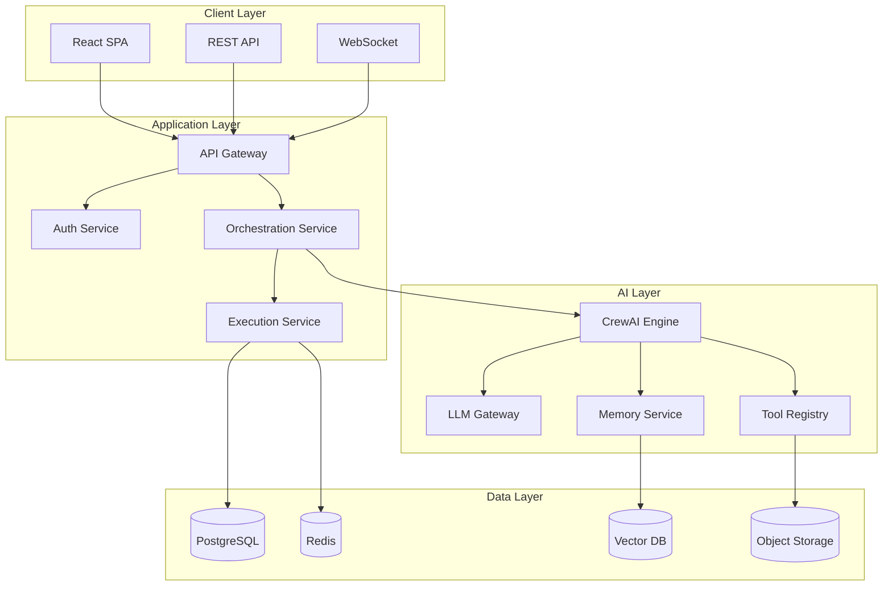

# 🔵 Kasal Solution Architecture

> **Enterprise AI Orchestration Platform** - Scalable, secure, cloud-native

*Visual workflow designer for creating AI agent collaborations*
---

## System Overview
What the platform aims to achieve and core design principles.

### Platform Vision
**Transform business workflows with autonomous AI agents** - Zero infrastructure complexity

### Architecture Principles
| Principle | Implementation |
|-----------|---------------|
| **Async-First** | Non-blocking I/O everywhere |
| **Microservices-Ready** | Clean boundaries, API contracts |
| **Zero-Trust Security** | Every request authenticated |
| **Infinite Scale** | Horizontal scaling, stateless |
| **Multi-Tenant** | Complete data isolation |

---

## High-Level Architecture
A big-picture view of the client, application, AI, and data layers.

---

## Architecture Pattern
The layered approach and how requests flow through components.

### High-level
- Layered architecture:
  - Frontend (React SPA) → API (FastAPI) → Services → Repositories → Database
- Async-first (async SQLAlchemy, background tasks, queues)
- Config via environment (src/backend/src/config/settings.py)
- Pluggable orchestration engine (src/backend/src/engines/ with CrewAI)

### Request lifecycle (CRUD path)
From HTTP request to response: validation, business logic, and persistence.
1) Router in api/ receives request, validates using schemas/
2) Router calls services/ for business logic
3) Service uses repositories/ for DB/external I/O
4) Data persisted via db/session.py
5) Response serialized with Pydantic schemas

### Orchestration lifecycle (AI execution)
How executions are prepared, run, and observed using the engine.
- Entry via executions_router.py → execution_service.py
- Service prepares agents/tools/memory and selects engine (engines/engine_factory.py)
- CrewAI path:
  - Prep: engines/crewai/crew_preparation.py and flow_preparation.py
  - Run: engines/crewai/execution_runner.py with callbacks/guardrails
  - Observability: execution_logs_service.py, execution_trace_service.py
- Persist status/history: execution_repository.py, execution_history_repository.py

### Background processing
Schedulers and queues for recurring and long-running tasks.
- Scheduler at startup: scheduler_service.py
- Embedding queue (SQLite): embedding_queue_service.py (batches writes)
- Startup/shutdown cleanup: execution_cleanup_service.py

### Data modeling
ORM entities, Pydantic schemas, and repository boundaries.
- ORM in models/* mirrors schemas/*
- Repositories encapsulate all SQL/external calls (Databricks APIs, Vector Search, MLflow)
- db/session.py:
  - Async engine and session factory
  - SQLite lock retry w/ backoff
  - Optional SQL logging via SQL_DEBUG=true

### Auth, identity, and tenancy
User context, group isolation, and authorization controls.
- Databricks Apps headers parsed by utils/user_context.py
- Group-aware multi-tenant context propagated via middleware
- JWT/basic auth routes in auth_router.py, users in users_router.py
- Authorization checks in core/permissions.py

### Security Controls
Defense-in-depth across network, API, data, secrets, and compliance.
| Layer | Control | Implementation |
|-------|---------|----------------|
| **Network** | TLS 1.3 | End-to-end encryption |
| **API** | OAuth 2.0 | Databricks SSO |
| **Data** | AES-256 | Encryption at rest |

---

### Storage Strategy
Where different data types live and why.
| Data Type | Storage | Purpose |
|-----------|---------|---------|
| **Transactional** | PostgreSQL | ACID compliance |
| **Vectors** | Databricks Vector | Semantic search |
| **Logs** | MLFlow traces | Observability |

---

### Observability
Logs, traces, metrics, and how to access them.
- Central log manager: core/logger.py (writes to LOG_DIR)
- API/SQL logging toggles (LOG_LEVEL, SQL_DEBUG)
- Execution logs/traces persisted and queryable via dedicated routes/services

### Configuration flags (selected)
Important toggles that affect developer and runtime experience.
-  DOCS_ENABLED: enables /docs
- AUTO_SEED_DATABASE: async background seeders post DB init
- DATABASE_TYPE: sqlite with SQLITE_DB_PATH

*Architected for scale, built for the future*